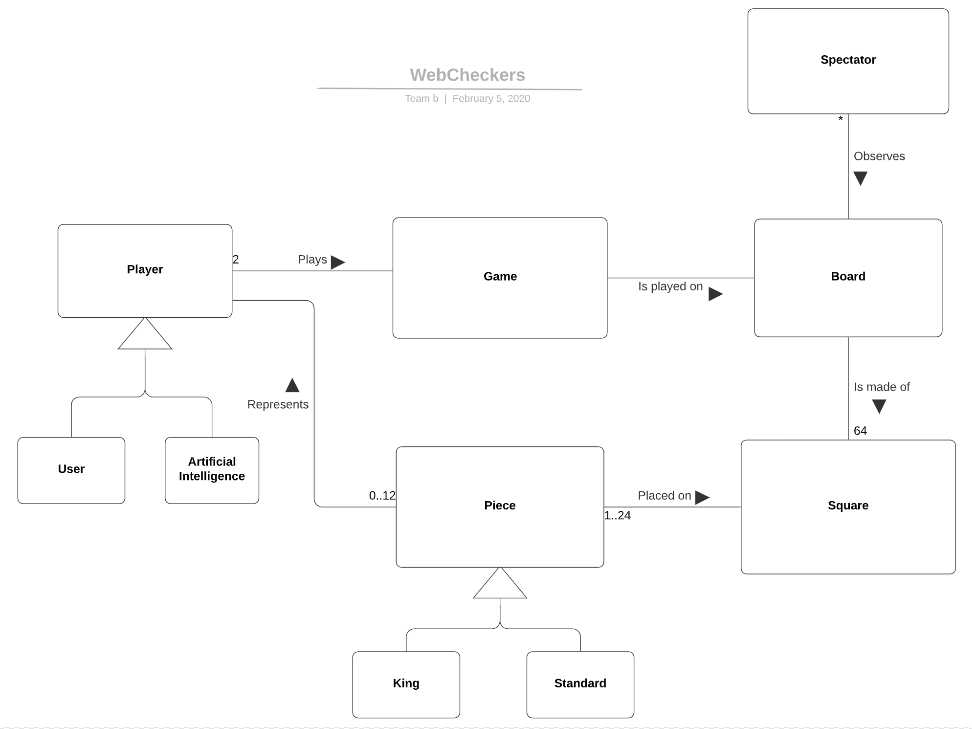
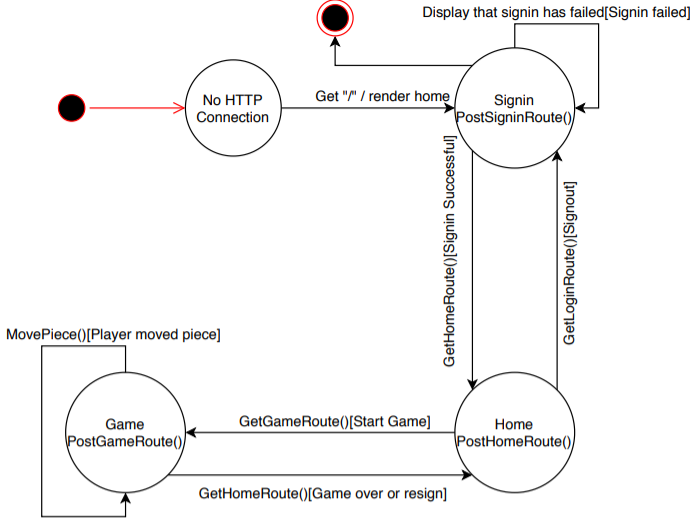

# PROJECT Design Documentation

## Team Information
* Team name: Team B
* Team members
  * Brayden Casella
  * Jake Waclawski
  * Gnandeep Gottipati
  * Dustin Crane

## Executive Summary

This project hosts a server for users to sign in and play checkers.

### Purpose

The purpose of the project is to host games for people to play checkers against
eachother. The most important user group is the player, and their goal to 
play games against eachother.

## Requirements

This section describes the features of the application.

Allows for users to sign into a server and see people who are in the lobby.
Players can start a game against another player in the same lobby.

### Definition of MVP

The minimum viable product allows for players to sign into a lobby,
start a game with another player in that lobby, and play and finish the
game with the other player.

### MVP Features

As a Player I want to sign-in so that I can play a game of checkers.
As a Player I want to start a game so that I can play checkers with an opponent.
As a PLAYER I want to MOVE A PIECE so that THE GAME PROGRESSES WITH THE MOVE.
As a PLAYER I want to GET NOTIFIED AFTER A GAME so that I KNOW WHO WON OR LOST.

### Roadmap of Enhancements

Make it so that the player can make a move in the correct order.
Have a game finish and notify which player won and lost.

## Application Domain

This section describes the application domain.

The player starts a game with another player. Those players can either be a user or a computer.
The Game is a board of spaces, that is played on. Pieces can be placed on the spaces. The pieces
also represent each player based on color. Each piece can either be a standard piece or a king.
A spectator can view the board.

## Architecture and Design

This section describes the application architecture.

### Summary

As a web application, the user interacts with the system using a
browser.  The client-side of the UI is composed of HTML pages with
some minimal CSS for styling the page.  There is also some JavaScript
that has been provided to the team by the architect.

The server-side tiers include the UI Tier that is composed of UI Controllers and Views.
Controllers are built using the Spark framework and View are built using the FreeMarker framework.  The Application and Model tiers are built using plain-old Java objects (POJOs).

Details of the components within these tiers are supplied below.

### Overview of User Interface

This section describes the web interface flow; this is how the user views and interacts
with the WebCheckers application.

The user first visits a sign in page where they are prompted to enter a username.
Upon entry of a valid username and clicking the submit button, they go into the lobby page.
The lobby page has a sign out button and a list of other players in the lobby. Each player
in the list of players can be clicked to start a game. When an available player is clicked,
The player is sent to a game lobby. The payer sees a game board where they an see their color, name,
opponent's name, and who's turn it is. The player can then move pieces and play through a game with
the opponent. When the game is completed, the player is prompted who won and returned to the lobby view.

### UI Tier

The server first validates the connection. After this the sign in page is posted.
Once the user requests the home route, the home route is posted to the user. Once
the user requests a game route, the game route is posted. Once the game is over,
the home route is posted.

### Application Tier

Each player is represented as a string of their username.
The game lobby is represented as a multiple lists of players. Each list
has a status based on the availability for the players in the to play a game.
Each game has two players and a game board. The board is represented as a list
of rows. Each row is represented as a list of spaces. And each space can have
a piece. Each piece is an enum of status that is possible.

### Design Improvements

The design of the player lobby could be optimized for better usage
of methods and better ways to handle the player status. The code could be
also be optimized to do the same functions, but also e easier to read
and understand.

## Testing

### Acceptance Testing

The player sign in to the game lobby has been successfully tested. The
player lobby selection has been tested. The game start from lobby has been
tested.
The functioning of the game has not been tested.

### Unit Testing and Code Coverage

Test all classes and make sure all test functions are passed. Make sure
the test functions test all aspects of the class being tested.
21 tests were successfully completed with no errors.
